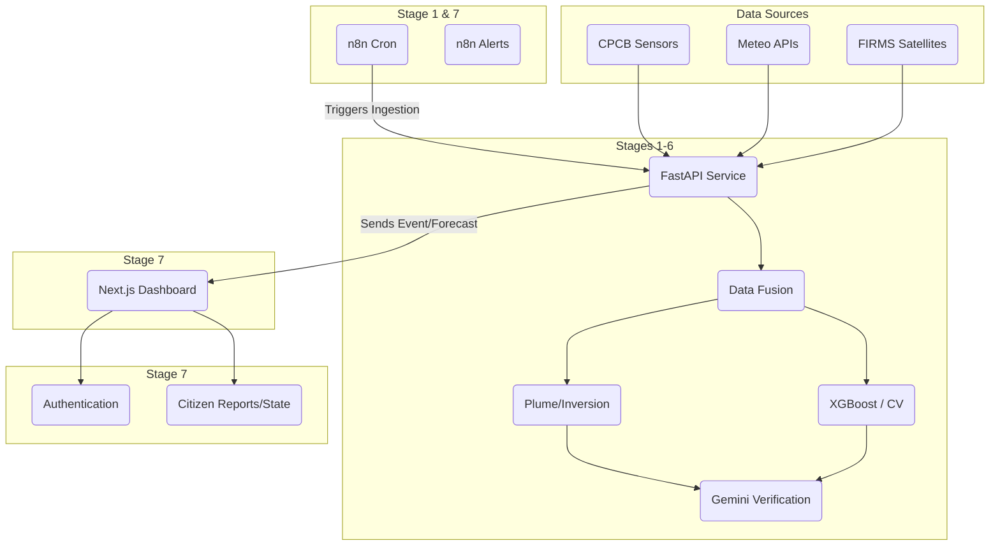

# VayuNet Infrastructure Architecture

This document describes the eight-stage VayuNet architecture and the specific boundaries and roles of FastAPI, ML, Firebase, and n8n within the system.

## The Eight-Stage Architecture

VayuNet adheres to a strict eight-stage pipeline. No ninth stage is permitted.

1. **OBSERVE**: Retrieval of CPCB, weather, Sentinel, and FIRMS data.
2. **FUSE & ASSIMILATE**: Cleaning, normalization, and alignment of environmental variables.
3. **COUPLED ATMOSPHERE**: Meteorological proxy diagnostics (e.g., inversion and plume influence heuristics).
4. **AI/ML INTELLIGENCE**: Application of XGBoost forecasting and Computer Vision pipelines.
5. **ENVIRONMENTAL INTELLIGENCE**: Synthesis of raw data and models into cohesive predictions.
6. **EVIDENCE VERIFICATION**: Utilizing Gemini to validate reports and event evidence.
7. **ACTION**: Presentation of intelligence, alerting, and citizen engagement.
8. **VALIDATE & IMPROVE**: Future system optimization (out of scope for current demo).

---

## Component Roles & Boundaries

### 1. FastAPI (The Core Backend)
**Primary Stages:** 1–6
- **Role:** FastAPI is the brain and primary engine of VayuNet. All scientific computation, ML model loading, data fusion, and API endpoints (like `/api/sih_forecast`) live here.
- **Strict Boundary:** FastAPI must never be bypassed by the frontend for critical environmental data. It orchestrates the scientific pipeline and serves the results to the frontend.

### 2. Frontend (Next.js App Router)
**Primary Stages:** 5, 7
- **Role:** The UI layer. It visualizes the 72-hour forecasts, environmental intelligence, and acts as the interface for authorities and citizens.
- **Strict Boundary:** The frontend must not invent or fabricate data. If FastAPI does not provide a metric (e.g., O3, NOx, PBLH), the frontend gracefully hides it or marks it as "Unavailable".

### 3. ML / Forecasting Layer
**Primary Stages:** 4–5
- **Role:** Embedded within the Python environment (called by FastAPI), this layer executes the trained XGBoost models to predict PM2.5 curves based on fused inputs.
- **Strict Boundary:** ML inference strictly executes in Python. It must not be ported to n8n or the browser.

### 4. Firebase (Application State & Identity)
**Primary Stage:** 7
- **Role:** Firebase is utilized **only** for user-facing application infrastructure. It provides Authentication (for authorities/citizens) and minimal Firestore collections (like `reports/` for citizen observations).
- **Strict Boundary:** Firebase **must not** store environmental data, WRF-Chem outputs, or core scientific forecasts. It is purely for application state (like alert subscriptions or user roles).

### 5. n8n (Orchestration & Automation)
**Primary Stages:** 1, 7
- **Role:** n8n acts as the scheduler and alert router. It triggers periodic updates (e.g., calling FastAPI ingestion endpoints every 6 hours) and routes notifications to external systems (Slack/Email).
- **Strict Boundary:** n8n is **not** a scientific engine. It does not perform ML inference, data fusion, or complex atmospheric calculations. It strictly schedules events and routes generic webhooks.

## Data Flow Diagram

## Implementation and Validation Status

*   **FastAPI Backend & Forecast Endpoints**: **IMPLEMENTED AND VALIDATED**. The `/api/sih_forecast` successfully serves the PM2.5 forecast (6h, 24h, 72h) and meteorological diagnostics based on real models.
*   **Next.js Frontend & Real Data Flow**: **IMPLEMENTED AND VALIDATED**. The UI consumes real backend data without mock measurements for PM2.5, wind speed, and inversion diagnostics. Unmodeled pollutants (PM10, O3, NOx) are honestly omitted and not fabricated.
*   **Firebase Integration**: **READY FOR CONFIGURATION**. The application architecture isolates Firebase purely to application state in `frontend/lib/firebase.ts`, but credentials have intentionally not been configured to avoid uncontrolled cloud provisioning.
*   **n8n Orchestration**: **IMPLEMENTED BUT RUNTIME-UNVALIDATED**. Workflows (`ingestion_trigger.json`) and docker configurations exist, but validation is blocked due to the lack of Docker in the current execution environment (`N8N_RUNTIME_VALIDATION_BLOCKED_DOCKER_UNAVAILABLE`).
*   **WRF-Chem Full Integration**: **EXPERIMENTAL**. The current diagnostic proxy uses heuristics rather than a computationally-heavy local WRF-Chem atmospheric simulation.

## Security & Deployment
- n8n runs via an isolated `docker-compose.yml` locally.
- Firebase relies strictly on environment variables (`NEXT_PUBLIC_FIREBASE_*`).
- No hardcoded API keys are committed to the repository.
- The public dashboard does not require Firebase authentication, ensuring public intelligence remains accessible.
